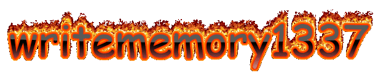

  

  

### writememory1337  &nbsp;&nbsp;🐧 &#12299; Linux & Open Source Enthusiast |.NET Dev
.NET Dev | Linux & Open Source Enthusiast | Automating all i can

----

&nbsp;&nbsp;&nbsp;

<strong>⚙️ C# .NET Developer</strong> ➤ <em>Specializing in Building Multi-Platform apps</em>

<strong>🎉 Open Source Enthusiast</strong> ➤ <em>Helping Grow Open Source Communities And Sharing Tech</em>

<strong>👾 Game Hacking Hobbyist</strong> ➤ <em>Rev.engineering & Decompiling games | Automating what i can</em>

----
